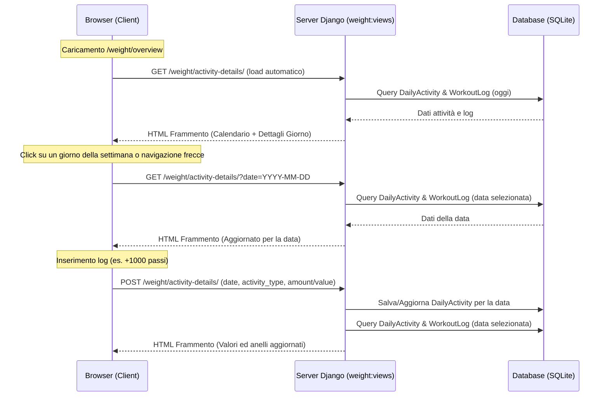

# Specifica di Design: Calendario Attività nelle Statistiche

Questo documento descrive l'integrazione del Calendario Attività e dei Dettagli Giornalieri (anelli di attività, log e grafico orario) all'interno della pagina delle statistiche (Scheda di Progressi).

## Obiettivi
1. Integrare un calendario settimanale orizzontale scorrevole nella parte superiore della pagina delle statistiche (`weight:overview`).
2. Visualizzare la scheda di attività giornaliera (anelli concentrici per passi, calorie, acqua) relativa alla data selezionata.
3. Permettere il logging dei dati direttamente per la data selezionata tramite richieste asincrone HTMX.
4. Visualizzare la distanza attiva (passi * 0.75m) e il consumo calorico del giorno.
5. Includere un grafico orario di allenamento per mostrare l'attività svolta durante le 24 ore della giornata selezionata.

## Architettura e Flusso Dati



## Dettagli di Implementazione

### 1. Endpoint e View (`wger/weight/views.py`)
Aggiungeremo la view `weight_activity_details`:
- **Metodo GET**:
  - Estrae il parametro `date` (formato `YYYY-MM-DD`). Se non fornito, usa la data locale corrente.
  - Costruisce la lista dei 7 giorni della settimana (da Lunedì a Domenica) che racchiudono il giorno selezionato. Ogni giorno conterrà il nome del giorno (iniziale), il numero del giorno, la data in formato stringa, e un flag per indicare se è il giorno correntemente selezionato.
  - Calcola le date della settimana precedente (selezionata - 7 giorni) e successiva (selezionata + 7 giorni) per i link delle frecce `<` e `>`.
  - Recupera o crea (tramite `get_or_create`) il record `DailyActivity` per l'utente e la data selezionata.
  - Calcola la distanza attiva: `activity.steps * 0.00075` km.
  - Estrae i log di allenamento (`WorkoutLog`) dell'utente per la data selezionata e calcola la distribuzione oraria (raggruppata su 24 ore) per popolare il grafico a barre di Chart.js.
  - Renderizza il frammento `activity_details_fragment.html`.
- **Metodo POST**:
  - Legge i parametri `activity_type` (passi, calorie, acqua), `amount` o `value`, e `date`.
  - Aggiorna il record `DailyActivity` per la data specificata (identico al funzionamento in `wger/core/views/user.py`, ma adattato per supportare date arbitrarie passate via form/richiesta).
  - Riesegue i calcoli di GET e restituisce lo stesso frammento HTML aggiornato.

### 2. Modifiche al Template Statistiche (`wger/weight/templates/overview_tailwind.html`)
- All'inizio del blocco `content`, inseriremo il contenitore HTMX:
  ```html
  <div id="activity-details-container" 
       hx-get="" 
       hx-trigger="load" 
       hx-swap="outerHTML">
  </div>
  ```

### 3. Nuovo Template Frammento (`wger/weight/templates/activity_details_fragment.html`)
Il frammento conterrà:
- Il titolo "Activity Calendar" e la riga dei giorni.
- La navigazione del mese sotto i giorni con `< Mese Anno >` che fa scattare un `hx-get` per cambiare settimana.
- La scheda dell'attività giornaliera con gli anelli SVG e i pulsanti di logging. Ciascun pulsante/form includerà un input hidden con il valore della data selezionata, garantendo che le operazioni POST modifichino la data corretta.
- Il riepilogo testuale ("Distanza in attività", "Calorie bruciate totali").
- Il grafico a barre orario delle 24 ore compilato dinamicamente con Chart.js.
