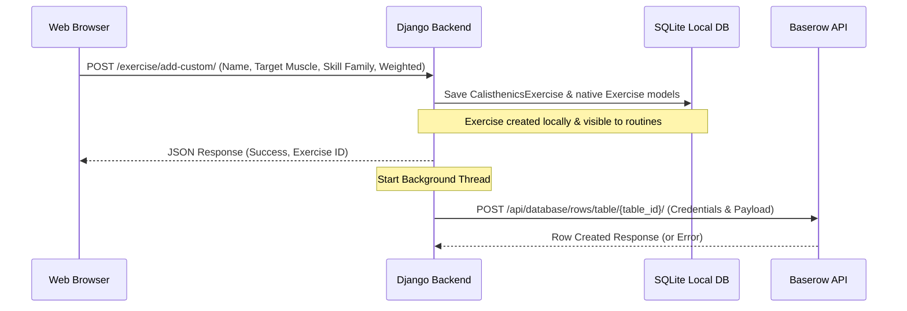

# Custom Exercise Creation & Baserow Synchronization Design Spec

## Objective
Enable users to create custom (personalized) calisthenics exercises directly from the routine builder interface. These exercises should be saved to the local SQLite database (making them immediately selectable and integrated with the wger ecosystem) and automatically uploaded to the self-hosted Baserow database.

---

## Architecture & Data Flow

---

## Database Changes
No schema changes are required for `exercises` or other local models, as the current `CalisthenicsExercise` and native `Exercise` fields cover all user inputs:
- `source`: Set to `'custom'` for user-created exercises.
- `source_exercise_id`: Set to a unique generated string `custom-<uuid>`.
- `equipment`: If "Weighted" is selected, set to `'weighted body weight'` and associate native `Dumbbells` or `Weighted body weight` equipment. Otherwise, set to `'body weight'` and associate native `Body weight` equipment.

---

## Component Designs

### 1. Frontend Modal Form
- **Location:** Integrated within [add_exercise_tailwind.html](file:///C:/Users/franc/Desktop/Codex/Workout_app/wger-elfrancia/wger/manager/templates/routines/add_exercise_tailwind.html).
- **Trigger:** A button "Crea Esercizio" next to the search/filters.
- **Fields:**
  - Name (text, required)
  - Target Muscle (select dropdown, loaded with existing muscles)
  - Skill Family (select dropdown, options: push_up, pull_up, dip, handstand, front_lever, back_lever, l_sit, planche, squat, other)
  - Weighted / Zavorrato (checkbox/toggle)
  - Instructions (textarea, optional)
- **Behavior:** On submission, the form sends an AJAX POST request. On success, it adds the new exercise to the UI list, selects it, and closes the modal.

### 2. Backend API Endpoint
- **URL:** `/<int:routine_pk>/day/<int:day_pk>/exercise/add-custom`
- **View:** `add_custom_exercise_tailwind(request, routine_pk, day_pk)` in [routine.py](file:///C:/Users/franc/Desktop/Codex/Workout_app/wger-elfrancia/wger/manager/views/routine.py).
- **Logic:**
  - Save `CalisthenicsExercise` and link it to the native `Exercise` structure.
  - Setup secondary relationships (`Translation`, `Muscle`, `Equipment`, `ExerciseTag`).
  - Return JSON `{"status": "success", "id": base_exercise.id, "name": name, "preview_url": "", "muscles": target_muscle, "skill_family": skill_family_display}`.
  - Trigger `threading.Thread` to execute `push_to_baserow` asynchronously.

### 3. Baserow Integration
- Use the same environment variables as in `import_exercisedb.py` and `sync_from_baserow.py` (`BASEROW_URL`, `BASEROW_TOKEN`, `BASEROW_DB_ID`, `BASEROW_TABLE_ID`).
- Call Baserow REST API endpoint `/api/database/rows/table/{table_id}/?user_field_names=true`.
- Handle network timeouts and errors gracefully.

---

## Verification & Testing
- Unit test in `wger/exercises/tests/test_custom_exercise.py` simulating the creation of a custom exercise and verifying SQLite records are created and the background synchronization function is triggered.
